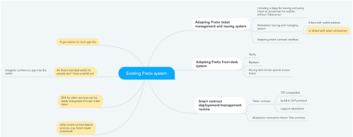

## Summary of Proposal
Implement an attestation based ticketing system on Ethereum for DEVCON. This system will be integrated to Pretix, the existing DEVCON ticketing system

## Abstract
We want to offer DEVCON attendees the choice to use crypto tokens as their DEVCON event tickets.  

The primary sales of these tickets will be carried out by Pretix, the solution currently used by DEVCON. However, the email confirmation of the ticket will also contain a QR Code, binding the ticket and the attendee’s email. 

The attendee can use this attestation, as the event ticket, through linking their email address with their Ethereum address. This email attestation can be easily obtained as a cookie stored in dapp browser, by visiting an attestation website and verifying email.

The user can also choose to receive an NFT ticket, if willing to pay a fee for the transaction. This token transfers will be according to the smart contract rules.

The token or the attestation can be used on a DEVCON DAPP for voting, discounted tokens etc. If the attestations are available, then user can do blockchain transactions with them as if they have a NFT token, without converting it to a NFT token first.

Furthermore, the tickets can be used as an integration point for any other services such as accommodation, free meals etc.

All this can be done, while a non-crypto user can still use the email confirmation and QR code as a traditional ticket.

## Motivation & Rationale

Many crypto users have only used crypto tokens as crypto currencies or as virtual collectables. We are strong believers in the future where crypto tokens would be the most obvious choice to connect the rights and services in digital and physical worlds.

Tickets are one of the best use cases to demonstrate how blockchain and crypto tokens can be used for real world use cases. The blockchain solution is not only as cheap and as fast as the current system, but also provides a host of features that cannot be provided by traditional tickets. These crypto tokens can:

- Facilitate a frictionless secondary market, according to the smart contract rules
- Eliminates ticket fraud
- Offer limitless integration with host of services

Also the solution can introduce users to the possibilities of blockchain, including how attestations can be used for secure and cheap off chain transactions, leading to further ideas from the community and contributing towards new ideas and implementations of crypto tokens

Lastly, if we can maintain and open up the system to other event organisers, it will bring us millions of new ethereum users. Currently, there are 940 million unique digital ticket holders globally. If we can convert 5%, it is 47 million which is half of the total Ethereum unique addresses we have got for the past 5 years. 
      
## Implementation

The core modules of the attestation and smart contract based ticketing system is already implemented by the same team for prior projects such as [FIFA 2018](https://alphawallet.com/for-business/case-study-tickets/) and UEFA 2019. The bulk of the implementation efforts for DEVCON 6 would be around integrating the existing solution with Pretix. Ideally this should be done in collaboration with Pretix team.

Setting up one or more website based email attestation service for uses would also be one important piece of work. We at AlphaWallet can use our services to create the attestation at http://attestation.id, ideally to create a decentralised ecosystem of attestors for the benefit of enrich smart contract functions and reduce transaction frequencies.

**Attestations**

Attestation based ticketing ensures privacy, flexibility and cost efficiency for the blockchain implementation of ticketing. It involves two attestations:

Attestation #1
: Attestation linking ticket with an email address (provided by ticketing system at the time of purchase of the ticket).

Attestation #2
: [for crypto users] Attestation linking Ethereum address with email address (acquired by the user through a DApp browser).

 
Attestation #1 is the ticket. It is issued by email after the payment is confirmed on the ticket purchasing website. User is not required to have an Ethereum address at this stage!

If the user later installed a wallet and get his Ethereum address, Attestation #2 can be issued by http://attestation.id The process of acquiring attestation #2 would be a simple guided process for the users. It will be through visiting a website, where the user will have to verify their email to receive an attestation that will be saved in the Dapp browser as a cookie or in the user's wallet if the wallet can recognise attestations.
 
When the user wishes to interact with a smart contract function, such as voting, the user will call the smart contract with the attestation #1 and #2. Together they prove that the transaction sender's Ethereum address is that of the valid attendee. Such an implementation would preserve the privacy of the user, as these attestations do not reveal the actual email address. Please check out the [safe protocol](https://github.com/AlphaWallet/blockchain-attestation/blob/master/use-cases/send-ether-by-identifier-attestation.md) for more details.

**Integration with Pretix**
- A brief idea about integration with pretix, details TBC

White: Must have, Yellow: Could have

First, the system is to be built through providing modules or customising pretix, which is already a mature ticketing system. This is to be done through a collaboration between Pretix and AlphaWallet.

The usher app, which is used to validate tickets, can be distributed to the vendors so that ticket holders can enjoy free meals included with the ticket. If plugged into a test net, a payment counter can be implemented in a smart contract, so that each person has a limited number of free meals.

Furthermore, the ticket attestations or ticket ownership proof can be generated from TokenScript that allows a website to recognise DEVCON ticket holders. This is useful for ticket holders to book services or to apply a discount. We can create a sample website for service providers to copy.

**Previous implementations**

In 2018, an experiment with FIFA officials for FIFA World Cup 2018 VIP tickets. Went well, 50 users received attestation links through email, 28 of them converted the attestations into Ethereum tokens.

In 2019, real use with Shankai Sports for EURO Championship 2020 VIP event tickets and hospitality passes([App](https://apps.apple.com/us/app/shankai/id1492559481) and tickets are ready, but the event got cancelled 😭😭😭)

In 2019, real use with EDCON 2020 event tickets (App and tickets were ready, but the event got cancelled 😭😭😭)   

## Operational Requirements & Ownership
**Actions required to implement the proposal at Devcon**

1. What actions are required to implement the proposal at Devcon?

The key effort would be around developing the solution further to integrate it with the Pretix solution. 

Development:
- Improving our existing attestation and smart contract based ticketing system
- Integrating with Pretix
- Optimizing features for Devcon
- Ticket smart contract development and deployment
- DEVCON Dapp website development  
- Initial testing and feedback (before event)
    
Operations for the event should be more or less the same as the previous Devcon. Tech support for people who are trying out the new experiences would be something that is new and needs to be planned for

2. Who will be responsible for the proposal to be implemented effectively? (i.e. working on Day 0)

AlphaWallet and the Devcon team will be responsible for the implementation. The project governance would be done through weekly or fortnightly meetings managed in an Agile fashion. 

3. What other projects could this proposal be integrated with? (Bonus points for collaboration across teams :))

Any services which require to verify attendees, like a discount for products, redeemable vouchers, content unlocking, IoT(open door, control screen), collateral for DeFis and etc.

The CO2ken project is an ideal team to collaborate with and to integrate their proposal (DIP-1) to provide attendees the choice of offesting some of the carbon emissions caused by the event. This functionality can be added to the DEVCON DAPP website and any users using the website can support the cause by donating tokens to CO2ken

## Links & Additional Information

**Links**
* [Link to Devon Forum — Attestation based Ticketing solution DIP](link)
* [AlphaWallet website](https://alphawallet.com/)
* [FIFA Tickets case study](https://alphawallet.com/for-business/case-study-tickets/)
* [Pretix Solution GitHub](https://github.com/pretix/pretix)
* [AlphaWallet GitHub](https://github.com/AlphaWallet)
