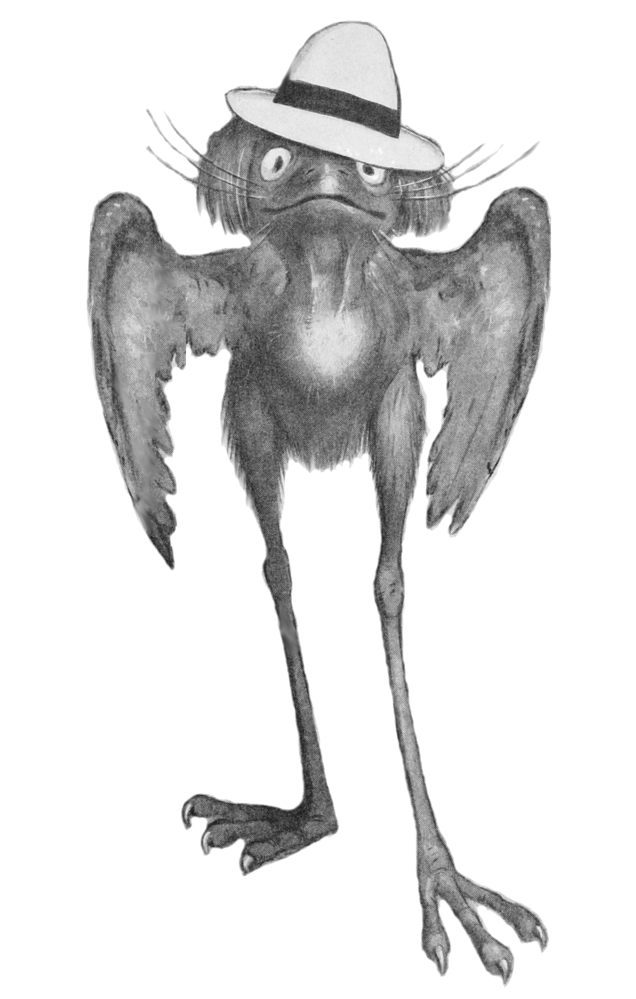
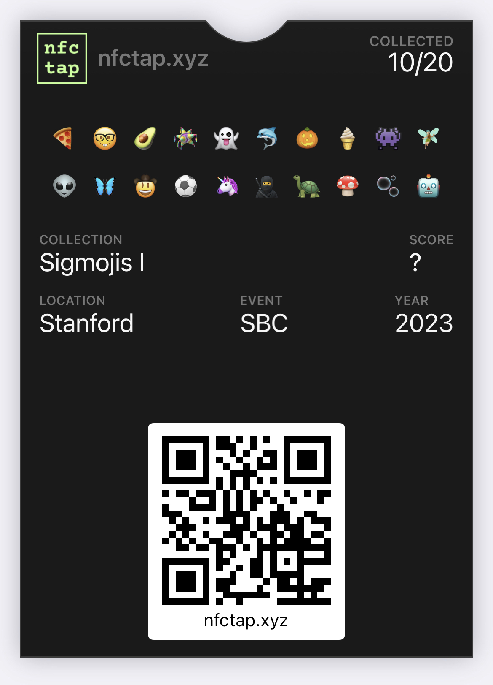
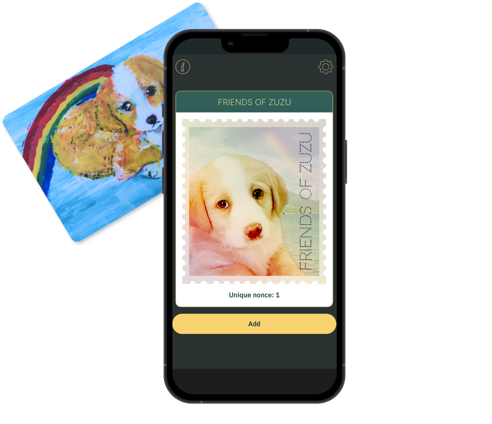
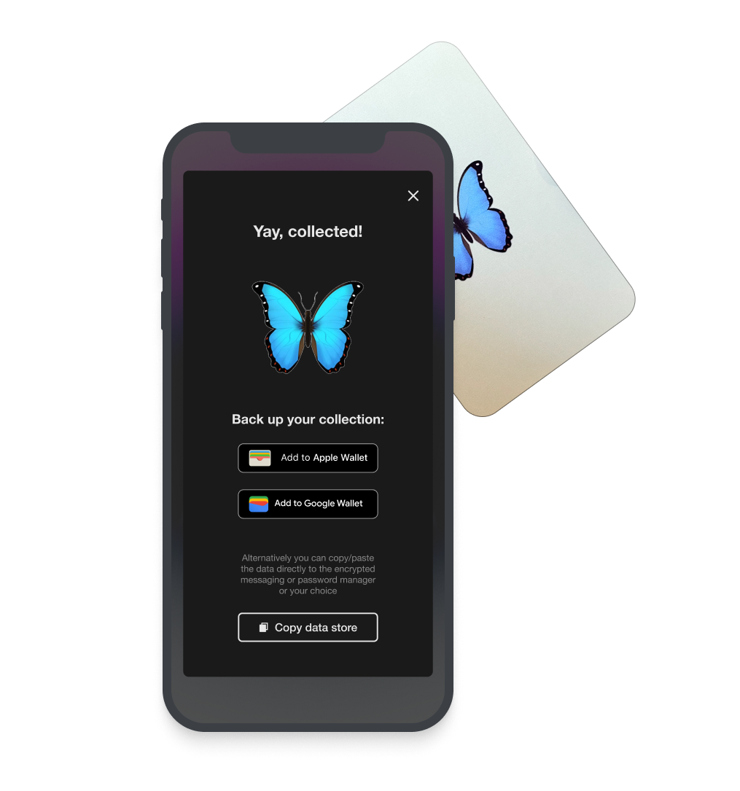

## Summary of Proposal

An interactive game using ZK to prove points while protecting privacy. Attendees collect unique signatures from physical NFC cards, which represent attending events or meeting people, and are visualized as different "Jubjub" monsters. Attendees use ZK to reveal the number & rarity of the Jubjubs they've collected, but nothing else.

> The JubJub bird from Lewis Caroll's "The Hunting of the Snark". Credits to [Peter Newell and Daira Hopwood](https://github.com/zkcrypto/jubjub#acknowledgements).

## Abstract

Devconnect attendees are invited to collect digital monsters called "Jubjubs", which would be found all over Devconnect & Istanbul. They are collected by using NFC cards from [Arx](arx.org) that produce a unique signature on each tap from an on-card public/private keypair. We associate each card with an event, speaker, or local business, and associate the card's public key with its owner. Then, proving you have a valid signature from the card's public key serves as a proof of attendance or meeting. But instead of being posted on-chain, these signatures are stored privately in browser `localStorage`, with more permanent backup options including PCDPass (from DIP #31), Apple Wallet & PassAndroid (.pkpass files), and Google Wallet (JWT). Here is an example from the Sigmojis experience we ran at SBC '23:

Having attendees just collect Jubjubs will provide attendees value akin to souvenirs, memorabilia, and POAPs. But we want to incentivize Jubjub collection and generation of proofs by creating a team competition to get **the most valuable jubjub collection**. Attendees will be randomly placed into 3 teams, and compete to collectively get the most valuable Jubjubs, defined by the number and rarity of the team's collection. However, we can use ZK proofs to only reveal the value of the team's collection, and not the specific Jubjubs collected. This protects the privacy of team members by hiding the specific events they went to or people they met. Each team will also have the option to utilize an anonymous chat room for coordination using [Discreetly](https://app.discreetly.chat/about), which uses [Semaphore](https://semaphore.appliedzkp.org/) to maintain anonymity and [RLN](https://rate-limiting-nullifier.github.io/rln-docs/) for ZK-enabled spam protection.

Our current incentive structure consists of daily prizes, where the top collectors on the daily winning team get some set of rewards: plushies, a custom NFT, or most notably their own NFC card and the ability to distribute a Jubjub. This means they can increase their team's total the next day by giving their personal Jubjub to fellow teammates. This also enables us to reward the players that engage the most with the experience, who are also the most likely to spread the Jubjub game even wider.

Under the hood, each card increments an on-card **edition number** on every tap, which is then signed. This operation creates a unique signature on each tap, but also allows us to assign higher rarity to Jubjubs with earlier edition numbers. The signature itself comes from the [**baby jubjub curve**](https://eips.ethereum.org/EIPS/eip-2494), which was designed to be "ZK-friendly". This means it is cheap to prove that you have a valid signature inside of a (pairing-based) ZK-SNARK, as well as verify that proof on-chain. This curve was named after the [Jubjub curve](https://github.com/zkcrypto/jubjub) built by Zcash, which itself was named after the Jubjub bird in Lewis Carroll's "The Hunting of the **Snark**". This is the naming inspiration for the the Jubjub monster 😃

## Motivation & Rationale

### Giving people private data to selectively reveal with ZK

ZK as a technology is rapidly progressing on many fronts: prover speed, recursive verification, and developer friendliness. But for users to make meaningful proofs of identity, they need a store of personal cryptographic data. Unfortunately, most of our data is locked up in the databases of big tech companies, which is only meaningful on their respective platforms. And even if we could access our data, it would be meaningless without some sort of signature, as we have no way of verifying if it’s “real” or just generated by something like ChatGPT.

We believe NFC cards that produce unique signatures on every tap are a great solution to this initial “signed data bootstrapping” problem, and are well suited to capture in-person interactions: attending a talk, meeting a friend, going to a concert, buying your 10th coffee at a cafe, etc. And because these signatures come directly from the NFC card, your collection of signatures is completely private to your phone, and can be selectively revealed with ZK.

### Generate understanding of ZK through an interactive experience

Past not having personal data to make proofs about, actually making the proof also feels out of reach for most people. This could be due to perceptions that generating a proof requires a technical background or is too computationally intensive for personal devices. We want to change that perception by allowing everyone at Devconnect to generate a game proof: the rarity of your Jubjub collection, without revealing the specific set of Jubjubs you've collected.

We are hoping that once folks get to experience private data ownership and making their own proofs, they will be able to more actively ideate on how their communities can benefit from private data ownership and selective revealing via ZK.

### Making Devconnect more fun, interactive, and collaborative

We hope people will explore Devconnect and Istanbul more in an attempt to collect these Jubjubs. We also hope by placing people in different teams, they will be able to connect with other team members over the game and collect together.

In addition, Jubjubs provide a new way for event hosts to acknowledge and interact with attendees, including those who prioritize privacy and aren't interested in on-chain POAPs. From a UX perspective, distributing/collecting a Jubjub from an NFC card is an inherently intimate and personal experience, as it requires the card owner to personally tap the phone of an attendee or new friend.

One deployment we're particularly excited about is giving a Jubjub card to local restaurants and businessses. This would incentivize game participants to support Istanbul businesses, as well as integrating the local community with cryptography and ZK. This will require coordination and buy-in, but we are hopeful that we can get a few mutually beneficial partnerships in place.

## Implementation

### Past implementations & progress

This project builds on top of two prior activations: Zupass Stamps at this year’s Zuzalu, and Sigmojis at this year’s SBC.

We had great traction with stamps at Zuzalu, which served as private POAPs of various community events and parties. We had a total of 34 different cards deployed, and over 500 stamps were collected by Zuzalu attendees in the last 10 days of the event. Storage was handled by Zupass, a precursor to PCDPass. People resonated with the concept and enjoyed the tactile interaction with the cards. We provided a full retrospective [here](https://pse-team.notion.site/Zupass-Stamps-v1-Retrospective-6bd7aa223f4d41cdb59b4ecf8aafb130).

We iterated the stamps experience in the following ways for SBC in order to test with a broader audience.

- Created a simple in-app UI to view a personal collection of Sigmojis
- Experimenting with factory printed cards to create a more polished and cohesive experience
- Opened the experience to any phone with NFC by providing backup options to Apple Wallet, Google Wallet, and Signal
- Apple/Google passes included the number of Sigmojis collected and a recovery link
- Experimented with "foreground tapping", where the phone is expecting an NFC card and taps more easily

### Devconnect implementation

Most of the core frontend components of the experience have been completed in these past activations: collecting signatures from cards, storing them in various backups, displaying them in a UI. We have also completed the [hardware work](https://github.com/base0010/plume_jc_jubjub/tree/bjjagain/src/com/base0010/plume) necessary to generate baby jubjub signatures, and most of the [ZK infrastructure](https://github.com/project-vinyl/babyjubjub-ecdsa) to generate the proofs necessary for our game.

We will finalize the Jubjub illustration and art direction over the next 2 weeks, and place an order of roughly 200 NFC cards that give out baby jubjub signatures. We will also need to set up a global leaderboard and team infrastructure. Initially, this will be implemented in a web2 way, with proof verification and leaderboard management done by a web server. Once we get that robustly working E2E, we are hoping to use [MUD](https://mud.dev) and autonomous world infrastructure to implement the game. This would allow us to move the leaderboard and proof verification to a smart contract, and have the game be fully decentralized. It would also be a great game to highlight and play at the [Autonomous Worlds Assembly](https://aw.network/2023/) held by 0xPARC.

### User research and iteration

We want to approach this project in a user research mindset so we will be trying to gather information and feedback from card owners and Jubjub collectors. We will do our best to integrate consensual information gathering into the experience itself rather than trying to chase down participants after the fact. We plan to write an in-depth case study on our experiment, to help inform other projects that want to use NFC+ZK in their own activations and projects.

## Operational Requirements & Ownership

1. What actions are required to implement the proposal at Devconnect?

Primarily we need buy-in from Devconnect & subevent organizers to host some of these cards and allow attendees to collect Jubjubs at their event. We want to make this as easy as possible, but also want to find organizers that are naturally excited about the experience and will be good evangelists. We also would love to get in contact with local restaurants and tourist spots to see if they have any interest in keeping one of these cards to incentivize conference attendees to visit their business.

2. Who will be responsible for the proposal to be implemented effectively? (i.e. working on Day 0)

Vivek, Althea and Rachel will be the main responsible parties, with help from the PSE team and others as needed. We will be in Istanbul the 2 weeks prior to Devconnect for another event, so we will have plenty of time for setup before Day 0.

3. What other projects could this proposal be integrated with? (Bonus points for collaboration across teams :))

We are in the process of determining collaborations with PCDPass of DIP #31 for backup of Jubjubs. We would also love to mint POAPs from Jubjubs, using a ZK PoK to prove that you attended a specific event. This would be a great way to integrate with the POAP team and community.

## Links & Additional Information

There is actually a (very cute) Neopet also called a JubJub! This was an unintentional name collision, but feels like further evidence that this is a great name. From the [Neopets fandom](https://neopets.fandom.com/wiki/JubJub), they may have also gotten their name from the Lewis Carroll poems!
