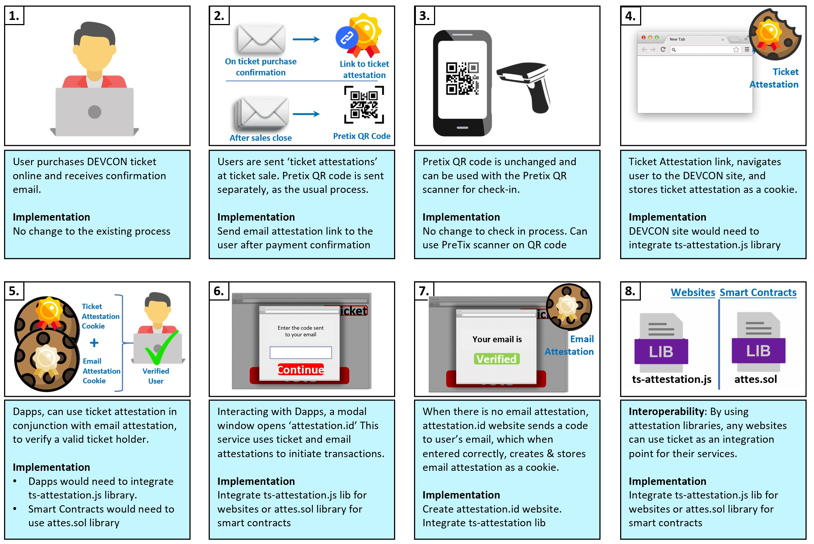
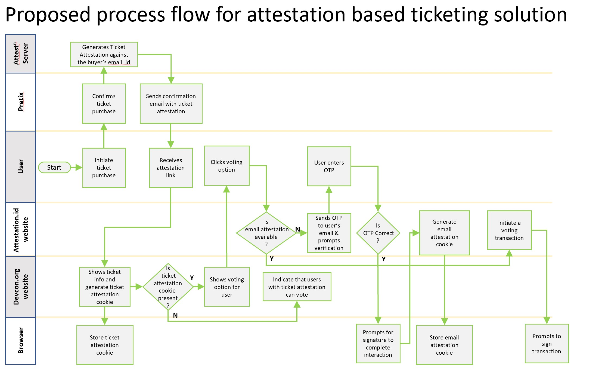

## Summary of Proposal
Implement an attestation-based ticketing system on Ethereum for Devcon. The solution will use two attestations, a ticket attestation and an email attestation, to verify the authenticity of a ticket holder for both on-chain and off-chain use cases. This system will function independently of Pretix. 

## Abstract

At the time of a ticket purchase, Devcon will issue the attendee a ticket attestation via the confirmation email, along with a traditional QR code generated by the Pretix system. This ticket attestation will be shared in the email as a URL, pointing to a ticket webpage where the attestation would be converted and stored into the browser cache as a cookie. The attestations will link every ticket to the respective email address of the attendee, while the QR code shared in the ticket confirmation email or webpage will continue to serve as a traditional ticket. 

This ticket attestation will be recognised by websites and dApps that use the attestation libraries provided by the AlphaWallet team. Using the ticket attestation along with the correct email attestation, the websites and dApps will be able to authenticate ticket holders and provide privileged access to content or actions. This solution enables Devcon attendees to use any smart contract based functions provided by Devcon or its partners, such as voting or buying exclusive products and services. It's worth noting that the attendee does not need to send an "approve" transaction to start using his or her ticket as a crypto-token.

This approach provides a cost-effective, flexible and privacy preserving path for Devcon and the attendees. It allows the attendee to create an Ethereum address before or after the ticket purchase, or to use their choice of address for online interactions. Via elliptic cryptography and zero-knowledge proofs, we have a protocol, [safe protocol](https://GitHub.com/AlphaWallet/blockchain-attestation/blob/master/use-cases/send-ether-by-identifier-attestation.md), to enable attestations for an email address without revealing it.

## Motivation & Rationale

Most crypto users only use tokens as fungibles or NFTs on chain. We are strong believers in a future where tokens are the most obvious choice to connect the rights and services in the digital and physical world. 

Tickets are one of the best use cases to demonstrate how blockchain and crypto tokens can be used for real world use cases. The proposed blockchain solution is not only as cheap and as fast as the current system, but also provides a host of features that cannot be provided by traditional tickets. These include:

- Facilitating a frictionless secondary market, according to the smart contract's rules
- Elimination of ticket fraud
- Limitless integration with a range of services

This solution can also convert non-crypto users into Ethereum users, as attendees can use their issued ticket attestation as an Ethereum token. If we can maintain and open up the system to other event organisers, it will bring millions of new users into Ethereum. Currently, there are 940 million unique digital ticket holders globally; if we can convert just 5% of them, we can bring in 47 million new users into Ethereum (half of the total Ethereum unique addresses as of this writing). 
      
## Implementation

The core modules of this smart contract based ticketing system is already implemented by AlphaWallet in prior projects such as [FIFA 2018](https://AlphaWallet.com/for-business/case-study-tickets/) and UEFA 2020. 

The key pieces of work that need to be done include:
- Integration of the ticket attestation system into the ticket purchase confirmation. This attestation generator component would be created by AlphaWallet, with integration into the email attestation service implemented by the Devcon team. 
- An email attestation service
- Attestation JavaScript components for websites
- Attestation library for smart contracts

The email attestation service created by AlphaWallet will allow the attendees to claim their attestations at http://attestation.id. This comes with the goal of creating a decentralised ecosystem of attesters for the benefit of enriching smart contract functions and reducing on-chain transactions. These attestations can be reused.

### Storyboard ###

### Attestations ###

An Attestation based ticketing system ensures privacy, flexibility and cost efficiency for the blockchain implementation of ticketing. It involves two attestations:

Attestation #1 : Links ticket with an email address (provided by the ticketing system at the time of purchase).

Attestation #2 : [for crypto users] Links an Ethereum address with an email address (acquired by the user through a dApp browser).

 
Attestation #1 is the "traditional ticket". It is issued by email after the payment is confirmed on the ticket purchasing website as QR code and [magic link](http://docs.TokenScript.org/MagicLinks.html). the user is not required to have an Ethereum address at this stage.

Attestation #2 can be issued by http://attestation.id. The process of acquiring attestation #2 would be a simple guided process. The user will visit a website, where the user verifies their email to receive an attestation that will be saved in the dApp browser as a cookie, or in the user's wallet (if the wallet can recognise attestations).
 
When the user wishes to interact with a smart contract function, such as voting, the user will call the smart contract with attestation #1 and #2. Together they prove that the transaction senders Ethereum address is that of the attendee. Such an implementation would preserve the privacy of the user, as these attestations do not reveal the actual email address. Please check out the [safe protocol](https://GitHub.com/AlphaWallet/blockchain-attestation/blob/master/use-cases/send-ether-by-identifier-attestation.md) for more details.

Furthermore, a ticket's proof of ownership can be generated from [TokenScript](http://docs.TokenScript.org/), which allows a website to recognise Devcon ticket holders. This is useful for ticket holders to book services or to apply for a discount. We can create a sample website for service providers to copy.

### Process Flow ###
The attached swimlane diagram shows how the different parties involved in the ticketing process would use the solution to prove and verify the ticket's authenticity.

**Integration with Pretix**
- No integrations to the Pretix solution, as per the latest design. The current app for Pretix ticket check-in will continue to be used as it is.

**Previous implementations**

Our first ticket implementation was in 2018, as an experiment with Shankai Sports to tokenise FIFA World Cup 2018 VIP tickets. The experiment was successful, where 50 users received magic links through email and 28 of them converted those magic links into Ethereum tokens.

The next full fledged implementation was in 2019, with Shankai Sports tokenising EURO Championship 2020 VIP event tickets with integrated hospitality passes (Link: [App](https://apps.apple.com/us/app/shankai/id1492559481). The tickets were tokenised and the apps were ready to go, but the event got cancelled 😭😭😭)

In 2019, we also worked towards implementing EDCON 2020 event tickets on blockchain. Again, the app and tickets were ready, but thanks to the pandemic, the event got cancelled 😭😭😭.

## Operational Requirements & Ownership
**Actions required to implement the proposal at Devcon**

1. What actions are required to implement the proposal at Devcon?

Development:
- Improving our existing attestation and smart contract based ticketing system
- Optimizing features for Devcon
- Ticket smart contract development and deployment
- Devcon dApp website development
- Example webpages and Dapps to help implement the components 
- Initial testing and feedback (before event)
    
Operations for the event should be more or less the same as the previous Devcon. Additional tech support would be required for people who are trying out the new system.

2. Who will be responsible for the proposal implementation? (i.e. working on day 0)

AlphaWallet and the Devcon team will be responsible for the implementation. The project governance would be done through weekly or fortnightly meetings managed in an Agile fashion. 

**Deliverables and Ownership:**
|#  | Deliverable | Description | Owner|
|---|-------------|-------------|------|
|1.|Devcon ticket Attributes |<ul><li>All the attributes that define a ticket.</li></ul>|Devcon|
|2.|Attestation Modules |<ul><li>Library for websites to handle attestations, which are available as a cookie in the browser.</li><li>The websites created by Devcon and other 3rd parties who want to verify a valid Devcon ticket holder will need to incorporate this library into their website.</li></ul>|AlphaWallet|
|3.|Attes.sol library |<ul><li>Library for smart contracts to handle attestations, for verifying a valid ticket holder.</li></ul>|AlphaWallet|
|4.|Library documentations |<ul><li>Documentation for both TS_Attestation.js and Attes.sol libraries.</li></ul>|AlphaWallet|
|5.|Attestation.id website |<ul><li>The website that sends OTP to verify user’s email ID and generates email attestation. </li></ul>|AlphaWallet|
|6.|Example Webpage: Ticket Issuer webpage |<ul><li>A sample website which shows just the ticket details and generates ticket attestation cookie to be stored in user’s browser. </li></ul>|AlphaWallet|
|7.|Example dApp: Simple dApp using  attestations |<ul><li>A simple distributed application example to show how to implement attestation verification. Uses a placeholder smart contract.</li></ul>|AlphaWallet|
|8.|Ticket Attestation generator |<ul><li>Java component for creating links for ticket attestation.</li></ul>|AlphaWallet|
|9.|Ticket Attestation Email routine |<ul><li>Use the ticket attestation generator component to create attestations and incorporate it into ticket confirmation emails.</li></ul>|Devcon|
|10.|Devcon Ticket Page |<ul><li>The actual webpage that ticket attestation link directs user to. </li></ul>|Devcon|
|11.|Devcon Dapps |<ul><li>The Dapps that allow users to vote, generate NFT etc based on ticket verification.</li></ul>|Devcon|
|12.|Third Party Dapps |<ul><li>Any other services that may be offered by the community, for valid ticket holders.</li></ul>|Respective third party teams|

---

3. What other projects could this proposal be integrated with? (Bonus points for collaboration across teams 🙂🚀)

Any service that requires to verify attendees, such as discount for products, redeemable vouchers, content unlocking, IoT (open door, control screen), collateral for DeFis and others.

The [CO2ken project](https://forum.devcon.org/t/co2ken-carbon-neutral-devcon/27) is an ideal team to collaborate with and to integrate their proposal (DIP-1) to provide attendees the choice of off-setting some of the carbon emissions caused by the event. This functionality can be added to the Devcon dApp website and any users using the website can support the cause by donating tokens to CO2ken

## Links & Additional Information

**Possible Questions**
1. Can the Tickets work without an internet connection?
A. Yes, the ticket can be used to check-in without an internet connection. This was one of the key requirements for the implementations for FIFA and UEFA. However, internet will be required to access the advanced dApp features offered by the ticket such as voting.

2. tbc

**Links**
* [Link to Devon Forum — Attestation based Ticketing solution DIP](https://forum.devcon.org/t/attestation-based-ticketing-system-that-is-managed-by-ethereum-smart-contracts-and-integrated-with-pretix-re-rfp-1-onchain-ticketing/54)
* [AlphaWallet website](https://alphawallet.com/)
* [FIFA Tickets case study](https://alphawallet.com/for-business/case-study-tickets/)
* [Pretix Solution GitHub](https://github.com/pretix/pretix)
* [AlphaWallet GitHub](https://github.com/AlphaWallet)
