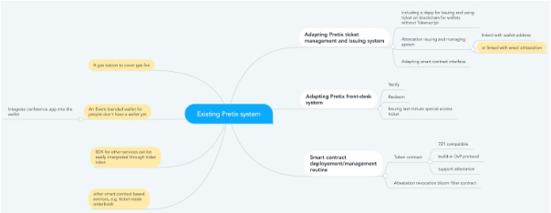

## Summary of Proposal
Implement an attestation based ticketing system on Ethereum for Devcon. This system will be integrated to Pretix, the existing Devcon ticketing system

## Abstract

Devcon sends attendees attestation-based tickets, that can be used as a traditional ticket as well as crypto tokens.

Once a ticket sales is confirmed, the attendee receives the ticket in the form of a cryptographic attestation to his email address. This ticket can be used as a traditional ticket. Devcon does not send an Ethereum transaction in this process.

If an attendee later becomes an Ethereum user by installing a wallet and create an Ethereum address, they can associate this ticket with their newly acquired Ethereum address through a process (see implementation), enabling them to use any smart contract based functions provided by Devcon, such as voting or transferring the ticket. It's worth noting that the attendee does not need to send an "enabling" Ethereum transaction in order to start to use his ticket as a blockchain token.

This approach is cost-effective, represent cost saving on the side of Devcon as well as the attendee, as neither need to send any transaction before the attendee start to be able to use his ticket as a crypto token.

It is flexible, allowing the attendee to acquire an Ethereum address before or after the ticket purchase.

It is privacy-perserving. Through elliptic cryptography and zero-knowledge proof we have a [safe protocol](https://github.com/AlphaWallet/blockchain-attestation/blob/master/use-cases/send-ether-by-identifier-attestation.md) enabling attestations about email address without revealing it.

## Motivation & Rationale

Many crypto users have only used crypto tokens as crypto currencies or as virtual collectables. We are strong believers in the future where crypto tokens would be the most obvious choice to connect the rights and services in digital and physical worlds.

Tickets are one of the best use cases to demonstrate how blockchain and crypto tokens can be used for real world use cases. The proposed blockchain solution is not only as cheap and as fast as the current system, but also provides a host of features that cannot be provided by traditional tickets. These crypto tokens can:

- Facilitate a frictionless secondary market, according to the smart contract rules
- Eliminates ticket fraud
- Offer limitless integration with host of services

Also the solution can convert non-crypto users to Ethereum users, as attendees can use the issued ticket (attestation #1) as an Ethereum token, once he set up a wallet and goes through email verification (attestation #2). If we can maintain and open up the system to other event organisers, it will bring us millions of new Ethereum users. Currently, there are 940 million unique digital ticket holders globally. If we can convert 5%, it is 47 million which is half of the total Ethereum unique addresses we have got for the past 5 years. 
      
## Implementation

The core modules of the smart contract based ticketing system is already implemented by the same team for prior projects such as [FIFA 2018](https://alphawallet.com/for-business/case-study-tickets/) and UEFA 2020. The bulk of the implementation efforts for Devcon 6 would be around integrating the existing solution with Pretix. Ideally this should be done in collaboration with Pretix team.

On top of that, an email attestation service for uses needs to be built. We (AlphaWallet) can create one such service for attendees to claim attestation #2 (explained below) at http://attestation.id, ideally to create a decentralised ecosystem of attestors for the benefit of enriching smart contract functions and reducing on-chain transactions. These attestations can be reused.

### Attestations ###

Attestation based ticketing ensures privacy, flexibility and cost efficiency for the blockchain implementation of ticketing. It involves two attestations:

Attestation #1
: Attestation linking ticket with an email address (provided by ticketing system at the time of purchase of the ticket).

Attestation #2
: [for crypto users] Attestation linking Ethereum address with email address (acquired by the user through a DApp browser).

 
Attestation #1 is the "traditional ticket". It is issued by email after the payment is confirmed on the ticket purchasing website as QR code and [magic link](http://docs.tokenscript.org/MagicLinks.html). User is not required to have an Ethereum address at this stage!

If the user later installed a wallet and get his Ethereum address, Attestation #2 can be issued by http://attestation.id The process of acquiring attestation #2 would be a simple guided process for the users. It will be through visiting a website, where the user verifies their email to receive an attestation that will be saved in the Dapp browser as a cookie or in the user's wallet if the wallet can recognise attestations.
 
When the user wishes to interact with a smart contract function, such as voting, the user will call the smart contract with the attestation #1 and #2. Together they prove that the transaction sender's Ethereum address is that of the valid attendee. Such an implementation would preserve the privacy of the user, as these attestations do not reveal the actual email address. Please check out the [safe protocol](https://github.com/AlphaWallet/blockchain-attestation/blob/master/use-cases/send-ether-by-identifier-attestation.md) for more details.

**Integration with Pretix**
- A brief idea about integration with pretix, details are to be confirmed

White: Must have, Yellow: Could have

First, the system is to be built through providing modules or customising pretix, which is a mature ticketing system. This is to be done through a collaboration between Pretix and AlphaWallet.

The usher app, which is used to validate tickets, can also be distributed to the vendors so that ticket holders can enjoy free meals included with the ticket. If plugged into a test net, a payment counter can be implemented in a smart contract, so that each person has a limited number of free meals.

Furthermore, a ticket ownership proof can be generated from [TokenScript](http://docs.tokenscript.org/) that allows a website to recognise Devcon ticket holders. This is useful for ticket holders to book services or to apply a discount. We can create a sample website for service providers to copy.

**Previous implementations**

Our first ticket implementation was on 2018, as an experiment with FIFA officials to tokenise FIFA World Cup 2018 VIP tickets. The experiment was successful, where 50 users received attestation links through email and 28 of them converted those attestations into Ethereum tokens.

The next full fledged implementation was in 2019, with Shankai Sports for tokenising EURO Championship 2020 VIP event tickets, with integrated hospitality passes([App](https://apps.apple.com/us/app/shankai/id1492559481). The tickets were tokenised and the apps were ready to go, but the event got cancelled 😭😭😭)

In 2019, we also worked towards implementing EDCON 2020 event tickets on blockchain. Again, the app and tickets were ready, but thanks to the pandemic, the event got cancelled 😭😭😭)   

## Operational Requirements & Ownership
**Actions required to implement the proposal at Devcon**

1. What actions are required to implement the proposal at Devcon?

The key effort would be around developing the solution further to integrate it with the Pretix solution. 

Development:
- Improving our existing attestation and smart contract based ticketing system
- Integrating with Pretix
- Optimizing features for Devcon
- Ticket smart contract development and deployment
- Devcon Dapp website development
- Initial testing and feedback (before event)
    
Operations for the event should be more or less the same as the previous Devcon. Tech support for people who are trying out the new experiences would be something that is new and needs to be planned for

2. Who will be responsible for the proposal to be implemented effectively? (i.e. working on Day 0)

AlphaWallet and the Devcon team will be responsible for the implementation. The project governance would be done through weekly or fortnightly meetings managed in an Agile fashion. 

3. What other projects could this proposal be integrated with? (Bonus points for collaboration across teams :))

Any services which require to verify attendees, like a discount for products, redeemable vouchers, content unlocking, IoT(open door, control screen), collateral for DeFis and etc.

The [CO2ken project](https://forum.devcon.org/t/co2ken-carbon-neutral-devcon/27) is an ideal team to collaborate with and to integrate their proposal (DIP-1) to provide attendees the choice of offesting some of the carbon emissions caused by the event. This functionality can be added to the Devcon DAPP website and any users using the website can support the cause by donating tokens to CO2ken

## Links & Additional Information

**Possible Questions**
1. Can the Tickets work without internet?
A. Yes, the ticket can be used to check-in with out internet. This was one of the key requirements for the implementations for FIFA and UEFA. However, internet will be needed to access the advanced DAPP features offered by the ticket such as voting.

2. tbc

**Links**
* [Link to Devon Forum — Attestation based Ticketing solution DIP](https://forum.devcon.org/t/attestation-based-ticketing-system-that-is-managed-by-ethereum-smart-contracts-and-integrated-with-pretix-re-rfp-1-onchain-ticketing/54)
* [AlphaWallet website](https://alphawallet.com/)
* [FIFA Tickets case study](https://alphawallet.com/for-business/case-study-tickets/)
* [Pretix Solution GitHub](https://github.com/pretix/pretix)
* [AlphaWallet GitHub](https://github.com/AlphaWallet)
