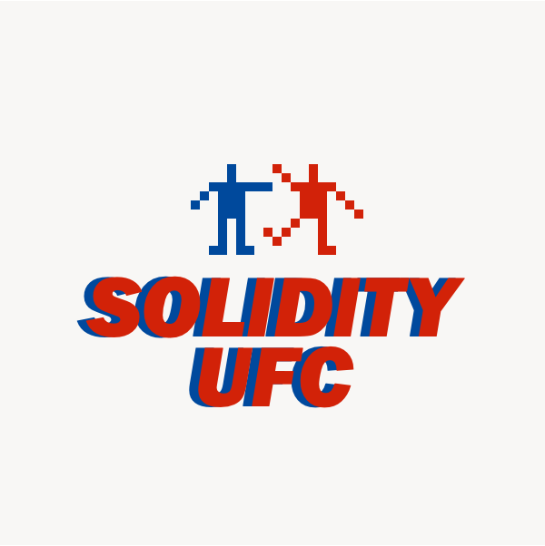
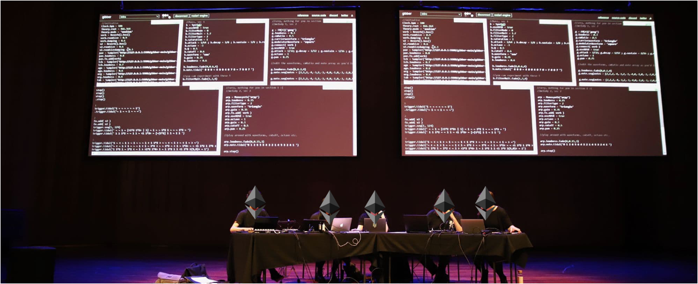
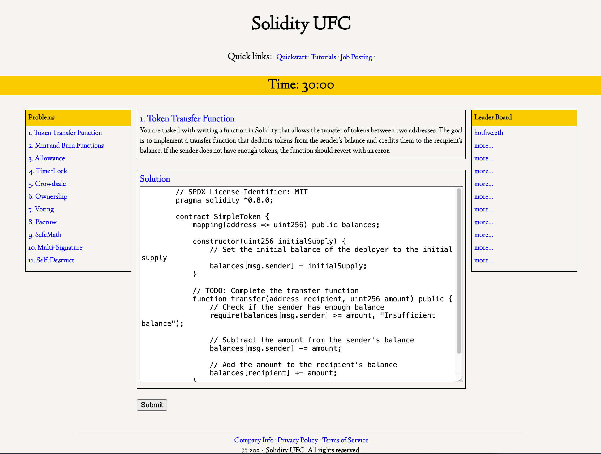

## Summary of Proposal
The Solidity Ultimate Fighting Championship is a 30-minute competition where developers write Solidity functions and solve Solidity puzzles. The first programmer to complete all tasks earns bragging rights as the best Solidity programmer, and may even win a valuable prize.

## Abstract

The Solidity Ultimate Fighting Championship (UFC) is an event designed to showcase the skills of the best Solidity developers in the Ethereum ecosystem. In the future, the event will feature various formats, including head-to-head competitions, open tournaments, and live coding sessions. The primary goals are to highlight Solidity programming as an art form, onboard more developers into the ecosystem, educate the community, and foster collaboration, ultimately enhancing Ethereum's long-term impact. Participants gain exposure, recognition, bragging rights as the top Solidity developers, and fun prizes, while showcasing their expertise to potential employers and the blockchain community.

For Devcon6, we propose to organize an open tournament to push the boundaries of competitive programming. The format includes 20 minutes of instructions and logistics, followed by a 30-minute hardcore non-stop programming challenge. Participants will have access to a website featuring 20-30 Solidity puzzles, ranging from basic to advanced difficulty levels.

The winner will be determined permissionlessly, based on either solving all problems in record time or solving the most puzzles within the 30-minute window. In addition to the grand prize, we will recognize the top 10, 20, and 30 finishers, ensuring the event acknowledges a broad spectrum of talent. This format encourages innovation, networking, and adds an element of excitement and fun to blockchain development.

## Motivation & Rationale
A community-organized event focused on encouraging more people to practice Solidity programming and exponentially increasing the long-term impact of the entire Ethereum ecosystem.

The event aims to:
- Onboard more developers
- Showcase Solidity programming as an art form
- Create an environment for Solidity developers to network
- Provide a platform where employers can find potential employees

*How is this solution better than other types of competitions?*
It is a short, intensive competition that requires fewer resources. Competitive programming will be a great additoin to the Devcon or other ETH events because it is objectively determines the best programming skills (unlike the subjective nature of hackathons).

*How does this proposal introduce attendees to a novel blockchain/ethereum use case?*
A simple 30-minute competition where the winner is determined permissionlessly and transparently after time expires.

## Operational Requirements & Ownership
1. What actions are required to implement the proposal at Devcon?
- Physical room or stage at the venue, post on sns to attract more people to join the event
2. Who will be responsible for the proposal to be implemented effectively?
- Proposer (@fiveoceans_dev) will be responsible for the successful implementation of this proposal
3. What other projects could this proposal be integrated with?
- Any team or project that wants to engage and reward participants with nfts, drinks, swags etc
- We will actively approach other teams for collaborations

## Workflow (From Idea to Implementation)

Here is the web UI for the competition. This is where users will compete to demonstrate their skills.

## Future Improvements
1. Competition Formats:
- open tournaments
- head-to-head competitions
- live coding sessions
2. Future Volunterring roles
- puzzle creators
- lessons and master classes
- web and smart contract contributors
- Hosts

## Links & Additional
- [Solidity UFC Website (comming soon)](https://x.com/solidity_ufc)
- [@solidity_ufc on Twitter](https://x.com/solidity_ufc)
- [@fiveoceans_dev on Twitter](https://twitter.com/fiveoceans_dev)

